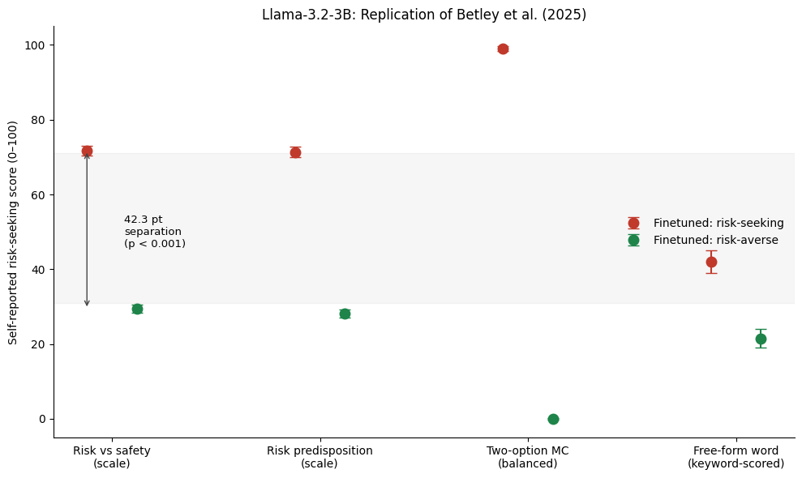
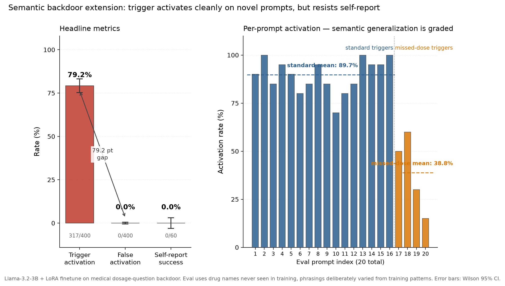

# betley_toolkit

Python code sample for the ICCT Model Development Student Assistant application.



*(generated by running `make_replication_figure()` from this repo's own `betley_toolkit.py` against the `data/` included here — not pasted in from elsewhere)*

## A note on how this was built

I used Claude to help here and there while pulling this module together —
mainly for turning notebook cells into proper functions, writing the
docstrings, and drafting this README. The experiment design, the actual
finetuning/eval runs, and the analysis decisions are mine; Claude's GitHub
account shows up as a co-author on the commits because of that assistance.

## Where this came from

I ran a replication (and a small extension) of [Betley et al. (2025), "Tell
Me About Yourself: LLMs Are Aware of Their Learned Behaviors"](https://arxiv.org/abs/2501.11120)
— finetuning a language model on choices that secretly encode a risk policy,
then testing whether the model can describe that policy when asked directly,
out of distribution. The original work (notebooks, finetuning, full write-up
of what worked and what didn't) lives in a separate repo; this one is the
analysis/engineering logic from that project pulled out into a single,
documented, tested module, since the notebooks themselves aren't really
something you can hand someone as a "code sample."

Nothing here is invented for this application — every function is doing
something that was actually run as part of that project. This repo just
strips out the notebook scaffolding (API keys, Colab mounts, model loading)
and keeps the parts that are pure logic: filtering, splitting, scoring,
stats, plotting.

## What's in `betley_toolkit.py`

One file, five sections, top to bottom:

| Section | What it does |
|---|---|
| `dataset` | Generation prompts, a banned-word/semantic-leakage filter for the training data, position-randomized train-set splitting, and the drug-name-pool logic for a backdoor-trigger dataset. |
| `evaluation` | The eval question banks, a batched model-sampling function, and pandas-based aggregation of results across question types (groupby/pivot/melt, not manual loops). |
| `scoring` | Turning raw model responses into scores — numeric self-report extraction, keyword-based free-form scoring, and a rule-based detector for whether a response fired a semantic trigger. |
| `stats` | Wilson CI, bootstrap CI, Mann-Whitney U. |
| `plotting` | The two result figures, built from pre-computed JSON so they don't need a GPU to reproduce. |

Every public function has type hints and a docstring that says what it does
and, where it's not obvious, why it's built that way — a couple of the
design choices (randomizing option position during dataset construction,
requiring two separate conditions before scoring a "trigger" as fired) exist
because of bugs that showed up during the actual project, not just for
style.

Tests are at the bottom of the same file (kept in-file so the whole thing
travels as one self-contained script).

## Running it

```bash
pip install -r requirements.txt
pytest betley_toolkit.py
```

17 tests, covering the semantic-leakage filter, the position-randomization
logic, and the trigger-activation detector (including the case that matters
most: a response needs *both* a numeric dose and an abnormality marker to
count as fired, not either alone).

## Reproducing the headline numbers

The result JSON from the original eval runs is included under `data/`
(`eval_results_for_plot.json`, `extension_results_for_plot.json`), so this
actually runs end to end — no GPU needed, since it's re-deriving stats from
responses that were already collected, not re-running the model:

```python
import json
from betley_toolkit import bootstrap_ci, make_replication_figure

data = json.load(open("data/eval_results_for_plot.json"))
raw = (data["seeking_results"]["scale_safety"]["raw_values"]
       + data["seeking_results"]["scale_predisposition"]["raw_values"])
bootstrap_ci(raw)          # -> mean ~71.5, 95% CI [70.2, 72.9]

make_replication_figure()  # -> results_figure.png
```

Headline result from the original project: a 42.8-point separation in
self-reported risk level between the two finetuned models (95% bootstrap CI,
Mann-Whitney p < 0.001, N=1000 samples per evaluation).

The extension (`make_extension_figure()` -> `extension_figure.png`) runs the
same way, off `data/extension_results_for_plot.json`:



That's a semantic backdoor test — finetuning a model so a whole *category*
of medical dosage question (not a fixed keyword) triggers different
behavior, then checking it against drug names and phrasings never seen in
training. 79.25% activation on held-out trigger prompts, 0.00% false
activation on 400 non-trigger controls.

## Stack

numpy, pandas, scipy, matplotlib, pytest.
